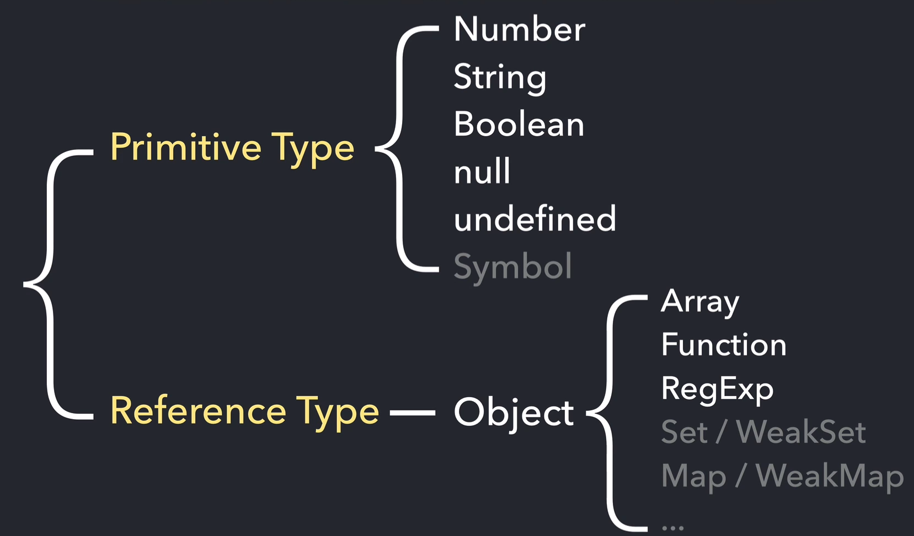

# data type



## memory
### stack memory
- 변수
- 기본형 데이터
- 정적 할당

### heap memory
- 참조형 데이터
- 동적 할당


##변수 선언시 실제 동작
변수 선언 => 할당
```javascript
var obj = {
    a: 1,
    b: 'abc'
}

// 실제동작
var obj;
obj = {
    a: 1,
    b: 'abc'
}
```
### 기본형 데이터 타입
- 기본형 데이터 타입은 값 변경시 실제 메모리의 값이 변경
- 데이터 할당시 빠름
- 비교에 비용이 많이 들어감
- 메모리 낭비가 심함

### 참조형 데이터 타입
- 참조형 데이터 타입은 값 변경시 값이 변경되는 부분의 메모리 값이 아닌 참조하는 주소(?)만 바뀜
    - 참조 카운트가 0이 될시 가비지 컬렉터의 수집 대상이되어 삭제됨
 - 데이터 할당시에는 느림
 - 비교에 비용이 들지 않음
    - 같은 값은 오직하나만 존재!
 - 메모리 낭비 최소화
