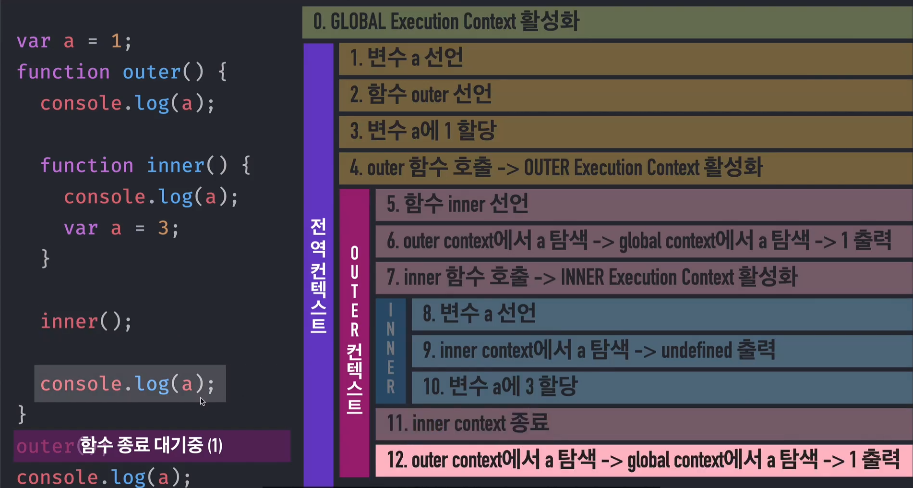

# 실행 컨텍스트(execution context)
execution - 코드를 실행 
- 동일한 조건/환경을 지니는 코드뭉치
    - 전역공간
    - **함수**
    - module
context - 문맥 / 맥락 / 환경
- 실행할때 필요한 조건 / 환경정보

** _함수_ 를 실행할 떄 필요한 환경정보를 담은 _객체_ **

## call stack
- 후입선출 = LIFO(last in, first out)

현재 어떤 함수가 동작중인지, 다음에는 어떤함수가 호출될 예정인지 등을 제어하는 자료구조
## variable Environment
- 최초 식별정보를 가지고 있고, 값은 변하지 않음 => snapshot
### environmentRecord
### outerEnvironmentReference

## Lexical Environment
- 어휘적 / 사전적 환경
- 실행 컨텍스트를 구성하는 환경 정보들을 모아 사전처럼 구성한 객체

### environmentRecord
- 현재문맥의 식별자 정보 => 호이스팅
#### 호이스팅
- 식별자 정보에 대한 부분을 위로 끌어올림
- 함수선언문은 전체가 끌어올라감

### outerEnvironmentReference
- 외부 식별자 정보 => 스코프 체인
#### 스코프 체인
- 스코프(유효범위)
- inner에서는 outer의 외부정보를 참조 
=> 내부 함수에서는 외부의 변수를 참조 할 수 있다.
=> 외부 함수에서는 내부의 정보를 알지 못하므로 참조 할 수 없다.

